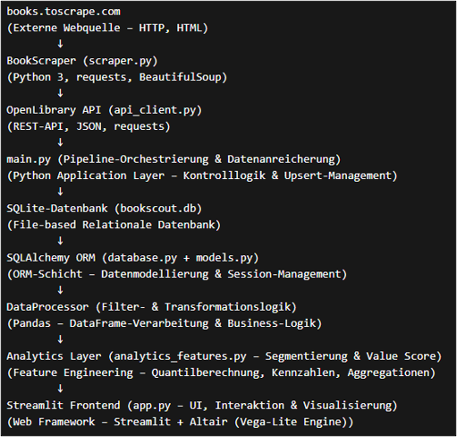
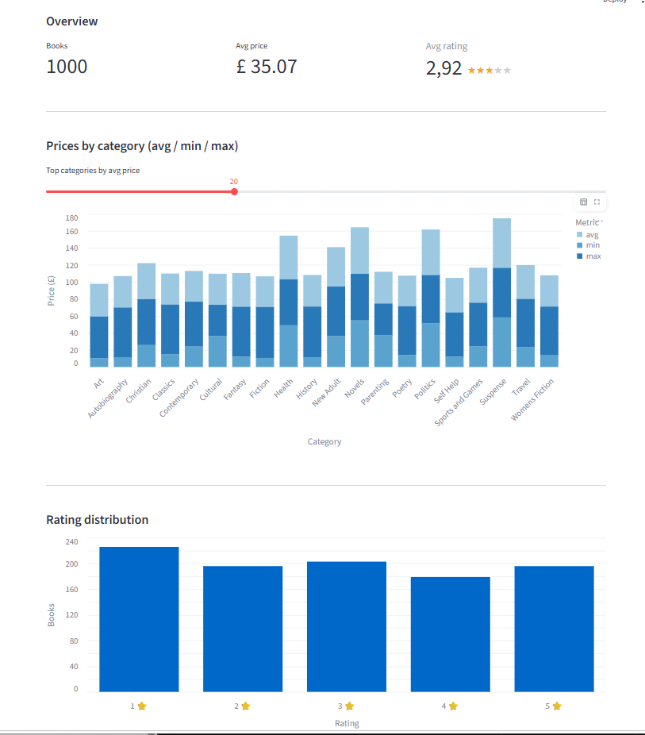
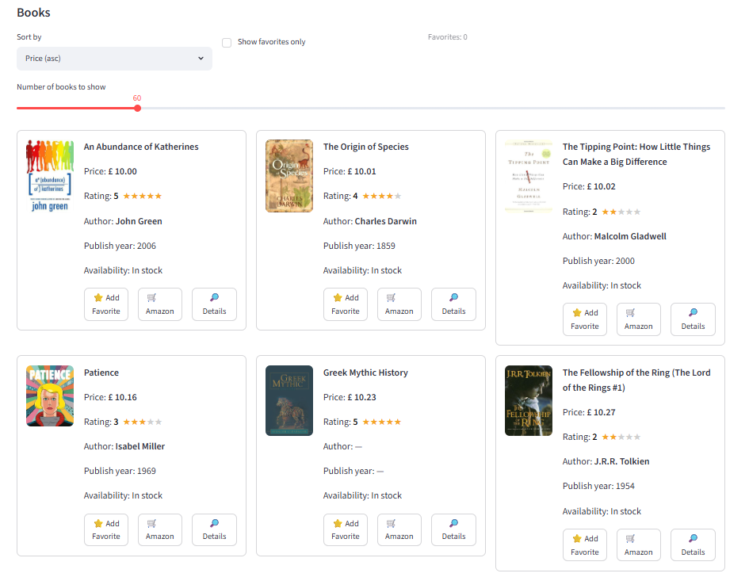
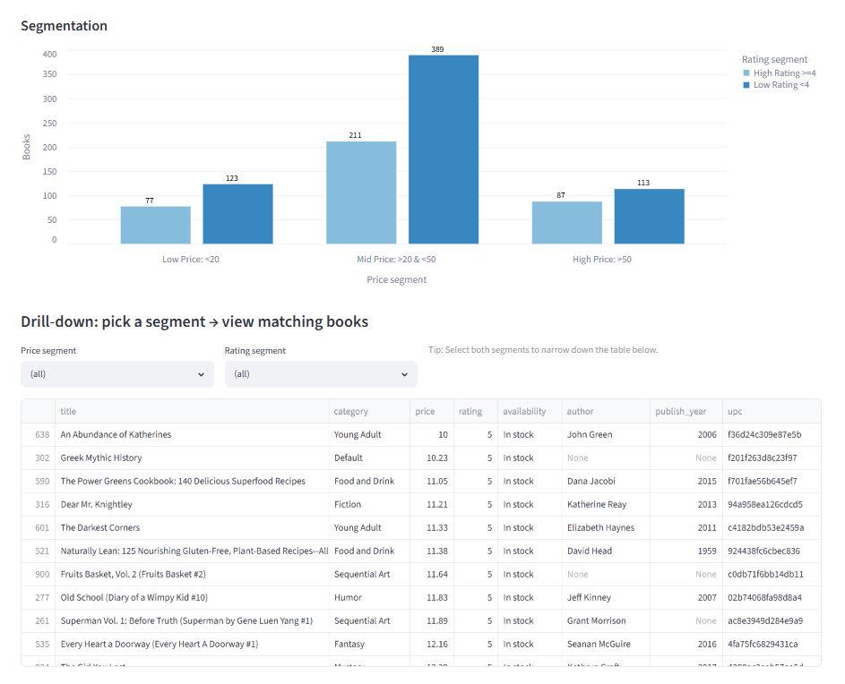

# 📚 BookScout – Book Analytics Dashboard

## Projektübersicht

BookScout ist ein interaktives Data-Analytics-Dashboard zur Analyse von Buchdaten.

Das Projekt kombiniert Web Scraping, Datenanreicherung über eine externe API, Datenbankmanagement und eine interaktive Visualisierung mit Streamlit.

Ziel des Projektes ist es, Buchinformationen automatisiert zu sammeln, aufzubereiten und durch ein Dashboard nutzbar zu machen.

---

## Datenpipeline

Der gesamte Datenprozess wurde automatisiert umgesetzt:

```text
books.toscrape.com
        ↓
Web Scraping
        ↓
Open Library API
        ↓
SQLite Database
        ↓
Streamlit Dashboard

---



---

## Verwendete Technologien

- Python
- Pandas
- Streamlit
- BeautifulSoup
- Requests
- SQLite
- SQLAlchemy
- Open Library API
- Datenvisualisierung

---

## Funktionen

### Datensammlung

- Automatisches Web Scraping von Buchdaten
- Extraktion von:
  - Titel
  - Preis
  - Bewertung
  - Kategorie
  - Verfügbarkeit

### Datenanreicherung

Zusätzliche Informationen wurden über die Open Library API ergänzt:

- Autoreninformationen
- Veröffentlichungsjahr
- Buchcover
- Beschreibung

### Datenbank

Die Daten werden strukturiert in einer SQLite-Datenbank gespeichert.

Der finale Datensatz enthält:

- 1.000 Bücher
- verschiedene Buchkategorien
- Preis- und Bewertungsinformationen

---

## Dashboard

Das interaktive Dashboard ermöglicht:

- Analyse wichtiger Kennzahlen
- Filterung nach Kategorien
- Preis- und Bewertungsanalyse
- Segmentierung von Büchern
- interaktive Buchsuche

---

## Dashboard Preview

### Übersicht




### Book Explorer




### Segmentierungsanalyse



---

## Projektdateien

### Source Code

Der vollständige Programmcode befindet sich im Ordner:

```
src/
```

### Datenbank

Die SQLite-Datenbank befindet sich im Ordner:

```
data/
```

### Präsentation

Die vollständige Projektpräsentation:

[presentation/bookscout_praesentation.pdf](presentation/bookscout_praesentation.pdf)

---

## Business Value

Dieses Projekt zeigt einen vollständigen datengetriebenen Workflow:

- Automatische Datenerfassung
- Strukturierte Datenspeicherung
- Datenanalyse
- Entwicklung eines interaktiven Analysewerkzeugs

Mögliche Einsatzbereiche:

- Produktanalyse
- Marktanalyse
- Preisoptimierung
- Empfehlungssysteme

---

## Projektstruktur

```
bookscout-streamlit-dashboard/

├── data/
│   └── bookscout.db
│
├── images/
│   ├── pipeline_architecture.png
│   ├── dashboard_overview.png
│   ├── book_catalog.png
│   └── segmentation_analysis.png
│
├── presentation/
│   └── bookscout_praesentation.pdf
│
├── src/
│   ├── app.py
│   ├── scraper.py
│   ├── database.py
│   └── ...
│
├── requirements.txt
├── README.md
└── .gitignore
```

---

## Autorin

Natalia Melnytska

Data Analytics | Python | SQL | Streamlit
